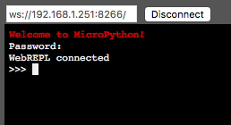

# Nastavení Wi-Fi

Připojme se na Wi-Fi. Blok kódu vložíme následovně. Zmáčkni před vložením Ctrl+E, a po něm Ctrl+D. Tím vypneš automatické odsazování, které při vkládání jenom vadí.

```python
SSID = 'TVOJE WIFI'
PASSWORD = 'TVOJE HESLO'
import network
sta_if = network.WLAN(network.STA_IF)
if not sta_if.isconnected():
    print('connecting to network...')
    sta_if.active(True)
    sta_if.connect(SSID, PASSWORD)
    while not sta_if.isconnected():
        pass
print('network config:', sta_if.ifconfig())
```

Mělo by se vypsat následující. Důležitý je poslední řádek `network config: ('192.168.1.251', '255.255.255.0', '192.168.1.1', '192.168.1.1')`, který vypisuje naši IP adresu.

```
paste mode; Ctrl-C to cancel, Ctrl-D to finish
=== SSID = ''
=== PASSWORD = ''
=== import network
=== sta_if = network.WLAN(network.STA_IF)
=== if not sta_if.isconnected():
===     print('connecting to network...')
===     sta_if.active(True)
===     sta_if.connect(SSID, PASSWORD)
===     while not sta_if.isconnected():
===         pass
=== print('network config:', sta_if.ifconfig())
connecting to network...
#5 ets_task(4020ed88, 28, 3fff9f68, 10)
network config: ('192.168.1.251', '255.255.255.0', '192.168.1.1', '192.168.1.1')
```

Teď se zkusíme připojit na modul vzdáleně.

1. Běž na http://micropython.org/webrepl/
2. Adresu v políčku `ws://192.168.4.1:8266/` změň na adresu, kterou ti vypsal `network config:`. Je to ta první hodnota. V mém případě `192.168.1.251`. Výsledek tedy je `ws://192.168.1.251:8266/`.
3. Klikni na connect.
4. Pokud jsi adresu zadala správně zeptá se tě příkazová řádka v prohlížeči na heslo.



WebREPL jsme ale nastavovali hlavně pro nahrávání skriptů.
