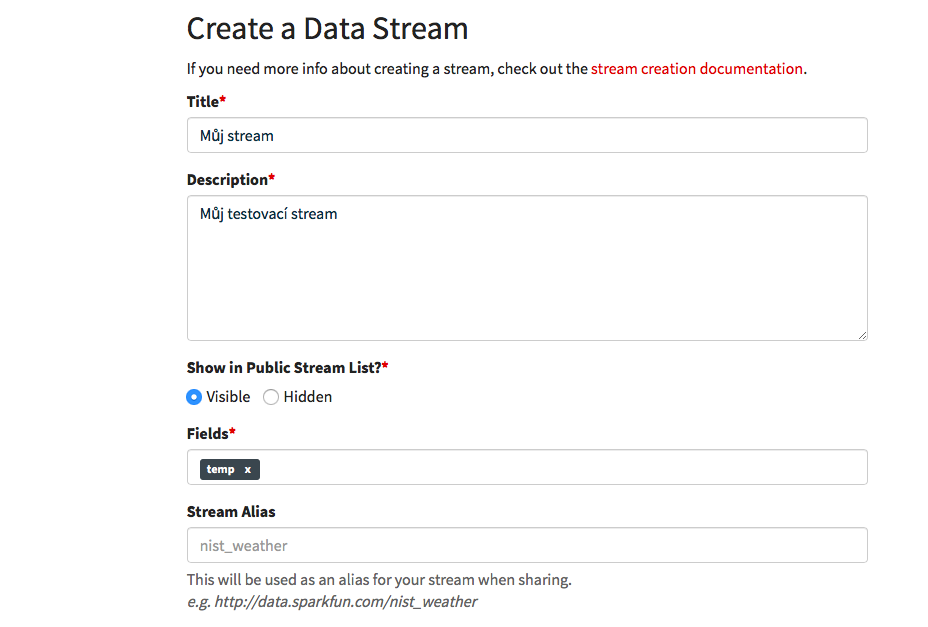
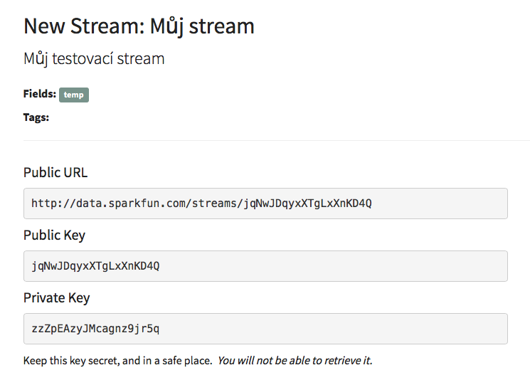

# Posíláme data na internet

Běž na [https://data.sparkfun.com](https://data.sparkfun.com) a klikni na červené tlačítko Create.

Vyplň formulář podle obrázku. Hlavní je pole `Fields` kam napiš `temp`.



Po odeslání formuláře na nás vyskočí několik hesel. Doporučuju si je poslat na mail. Hlavní jsou `Public Key` a `Private Key`.



Abychom poslali data musíme použít komplikovanější HTTP požadavek zvaný `POST`. Tady je ukázka jak vypadá.

```python
data = b'temp=' + temperature

s.write('POST /input/' + PUBLIC_KEY + ' HTTP/1.0\r\n')
s.write('Host: '+ HOST + '\r\n')
s.write('Phant-Private-Key: ' + PRIVATE_KEY + '\r\n')
s.write('Content-Type: application/x-www-form-urlencoded\r\n')
s.write('Connection: close\r\n')
s.write('Content-Length: ' + str(len(data)) + '\r\n\r\n')
s.write(data)
```

Celá metoda je v souboru `sparkfun.py`, kam doplníme `Public Key` a `Private Key`. Pak pomocí `python webrepl_cli.py workshop/sparkfun.py TVOJE-IP:/` nahraj soubor do modulu.

Teď pošleme templotu do úložiště, které jsme si právě vytvořili. Spusť skript ze sekce [Čteme teplotu](cteme-teplotu.md), který nám do proměnné `temp` uloží aktuální teplotu. A pak spusť následující dva řádky.

```python
import sparkfun
sparkfun.send_temperature(temp)
```

Teplota by se měla objevit v tabulce na adrese https://data.sparkfun.com/streams/PUBLIC_KEY. Nezapomeň `PUBLIC_KEY` nahradit svým klíčem. Dívat se na teplotu v tabulce ale není úplně ideální. Když otevřeš soubor `graph.html` uvidíš můj stream, aby jsi viděla svůj nahraď klíč v konstantě `public_key` svým klíčem.
